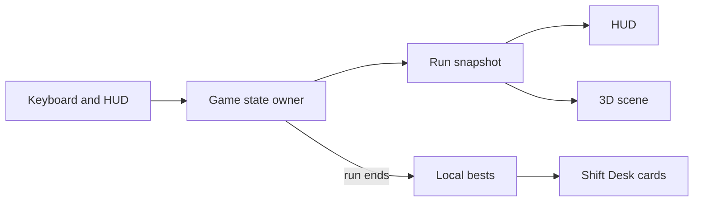

# System Architecture — Minewalker

## Component breakdown

| Component | Responsibility |
|-----------|----------------|
| Campaign shell | Cover, guide, Shift Desk; hands off into a chosen mode |
| Game state owner | Board, player, timer, win/loss; publishes run snapshots |
| Pure mine rules | Generate, reveal, flag, flood, endless expand — engine-free |
| Scene layer | Cave, rocks, miner, lights, cameras, blast feedback |
| HUD | Stats, cameras, training tips, end-of-run report |
| Score store | Local bests read by Desk cards and reports |

Browser-only. No server backend.

## Data flow

## Integration points

- Desk card → enter mine with a mode
- Dig / flag / move / restart → mutate game state → refresh HUD + scene
- Loss → blast presentation, then delayed report
- Deep-link params → skip cover into play; optional arrival toast

## Technical choices that shape the system

- **Rules vs view:** mine logic stays portable; the scene only mirrors snapshots
- **Snapshot pub/sub:** one owner, many listeners
- **Local persistence only:** bests survive refresh without accounts
